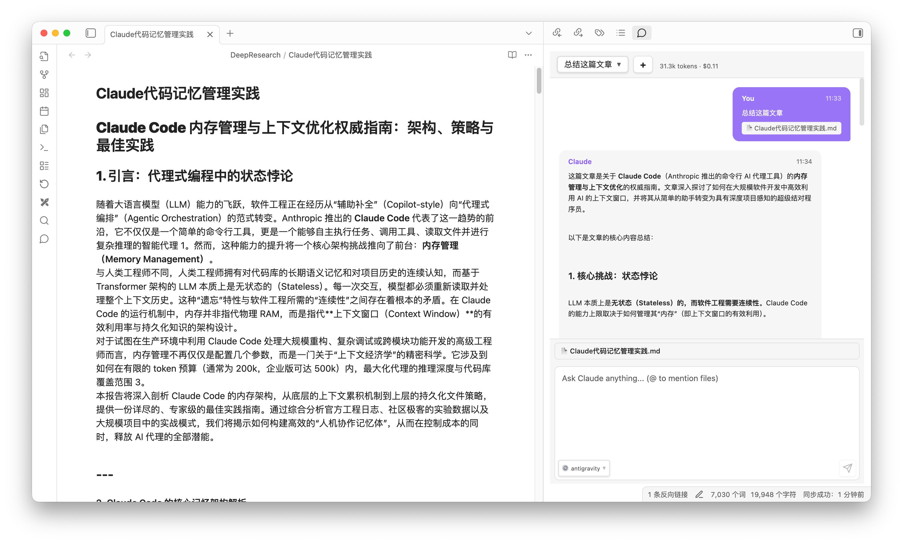

# Obsidian Claude Code

An Obsidian plugin that integrates Claude Code capabilities into your vault through a chat interface in the sidebar.



## Features

- **Chat with Claude** - Directly in Obsidian's right sidebar
- **File Operations** - Claude can read, edit, create, and search files in your vault
- **Context Awareness** - Auto-includes current file and selected text in conversations
- **@ Mentions** - Quick file/folder path autocomplete with `@`
- **Environment Templates** - Switch between multiple API configurations
- **Session Management** - Conversation history with token usage tracking
- **Streaming Responses** - Real-time feedback as Claude responds
- **Slash Commands** - `/compact`, `/clear`, `/help` and more
- **Third-Party Providers** - AWS Bedrock, Google Vertex AI support

## Quick Start

1. Install and enable the plugin
2. Go to Settings > Claude Code > Environment Templates
3. Create a template and add `ANTHROPIC_API_KEY`
4. Open the chat panel (click ribbon icon or use command palette)
5. Start chatting!

## Usage

### Basic Chat

Type your message and press `Enter` to send. Claude will respond and can interact with your vault files.

### Context Features

- **Current File Context** - The file you're editing is automatically included
- **Selected Text** - Select text in the editor, it will be sent to Claude
- **@ Mentions** - Type `@` to search and insert file/folder paths

### Session Management

- Use the dropdown at the top to switch sessions
- Click `+` to create a new session
- Token usage and cost are displayed per session

### Environment Templates

Switch between different API configurations (e.g., different models, providers) using the selector at the bottom-left of the input box.

## Requirements

- [Claude Code CLI](https://docs.anthropic.com/en/docs/claude-code) installed
- Anthropic API key (or configured third-party provider)
- Obsidian desktop app (not mobile)

## Installation

### From Source

```bash
cd /path/to/your/vault/.obsidian/plugins/
git clone https://github.com/your-repo/obsidian-claude-code.git
cd obsidian-claude-code
npm install
npm run build
```

Reload Obsidian and enable the plugin in Settings > Community plugins.

## Configuration

### Environment Templates

Create templates in **Settings > Claude Code > Environment Templates**:

| Variable | Description |
|----------|-------------|
| `ANTHROPIC_API_KEY` | Your Anthropic API key |
| `CLAUDE_MODEL` | Model to use (e.g., `claude-sonnet-4-5-20250929`) |
| `CLAUDE_CODE_PATH` | Path to Claude Code executable (auto-detected) |

#### Third-Party Providers

**AWS Bedrock:**
```
CLAUDE_CODE_USE_BEDROCK=1
AWS_REGION=us-east-1
AWS_ACCESS_KEY_ID=your-key
AWS_SECRET_ACCESS_KEY=your-secret
```

**Google Vertex AI:**
```
CLAUDE_CODE_USE_VERTEX=1
CLOUD_ML_REGION=us-central1
ANTHROPIC_VERTEX_PROJECT_ID=your-project-id
```

### Tool Permissions

Control which tools are available:

- **File Reading** - Read, Glob, Grep tools
- **File Editing** - Edit tool for modifying files
- **File Creation** - Write tool for new files
- **Search** - Grep tool for content search

### UI Settings

- **Show Tool Results** - Display tool execution details
- **Auto-scroll** - Scroll to newest message
- **Chat Font Size** - Adjust message font size (12-20px)

## Troubleshooting

### Claude Code not found

```bash
which claude  # Find the path
```

Add the result as `CLAUDE_CODE_PATH` in your environment template.

### API Key Issues

Ensure `ANTHROPIC_API_KEY` starts with `sk-ant-`.

## Development

```bash
npm install      # Install dependencies
npm run dev      # Development build with watch
npm run build    # Production build
```

## License

MIT
